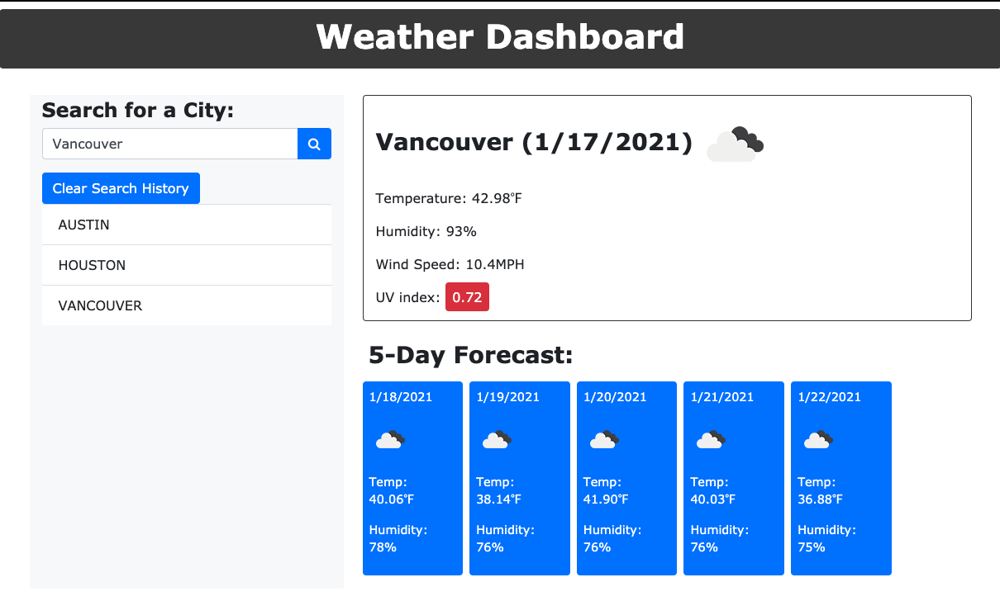

# Weather-Dashboard

## Description
Weather-Dashboard is an application allows user to search a city to get its current  current weather conditions and 5-Days forecast.
The server-side API used to get response data object comes from the Open Weather APi.

The current weather section is includes the following:

* City, Date, Icon-image
* Temperature
* Humidity
* Wind Speed
* UV index

The 5-day weather forecast displayed below the current weather conditions section includes the following information for each additional day:

* Date
* Icon image
* Temperature
* Humidity

### How:
* When User searches for a city he/she is presented with current and future conditions for that city and that city is added to the search history.
* When user views current weather conditions for that city he/she is presented with the city name, the date, an icon representation of weather conditions, the temperature, the humidity, the wind speed, and the UV index.
* When user views the UV index he/she is presented with a color that indicates whether the conditions are favorable, moderate, or severe
* When user views future weather conditions for that city
he/she is presented with a 5-day forecast that displays the date, an icon representation of weather conditions, the temperature, and the humidity
* When user clicks on a city listed in the search history he/she is again presented with current and future conditions for that city.

**GitHub URL:** <https://github.com/irjaimes/weather-dashboard>

**App URL:**  <https://irjaimes.github.io/weather-dashboard/>

**Resources:**

* Bootstrap: 
<https://cdnjs.cloudflare.com/ajax/libs/twitter-bootstrap/4.0.0/js/bootstrap.bundle.min.js>
* jQuery:   
<https://code.jquery.com/jquery.js>
* OpenWeatherAPI:   
<https://openweathermap.org/api>
* Mozilla Global Objects:  
<https://developer.mozilla.org/en-US/docs/Web/JavaScript/Reference/Global_Objects>
* Font Awesome:  
<https://fontawesome.com/>

